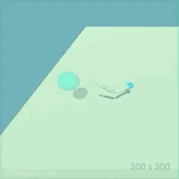
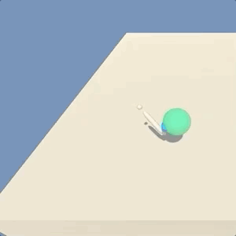

# reacher-ddpg

A random agent             |  A trained agent
:-------------------------:|:-------------------------:
 | 

*Examples of a random agent and an agent trained to position its arm within the (green) target region.*

# The Model and Environment
This project implements [Deep Deterministic Policy Gradient (DDPG)](https://spinningup.openai.com/en/latest/algorithms/ddpg.html) [1]
to solve the ["Reacher" Unity ML Environment](https://github.com/Unity-Technologies/ml-agents/blob/master/docs/Learning-Environment-Examples.md#reacher).
The goal in this environment is to train an agent that's capable of maneuvering a robotic arm such that its hand is
located within the target region (seen as a green sphere in the GIFs above). This project was completed as part of the
[(Unity-sponsored) Udacity course on Deep Reinforcement Learning](https://unity3d.com/learn/drl-nanodegree).

## Observation Space
33 real-valued variables describing the position, rotation, velocity, and angular velocities of the arm. 

## Action Space
A float vector of size 4. The arm contains 2 joints, and each joint can be moved with 2 torque values. (Every entry is
bound between [-1, +1].)

## Reward Function
The agent receives a reward of +0.1 for every time step the hand is within the desired region.

## Solved
The environment is considered solved when the agent can receive an average reward of +30 or more, over a window of 100
episodes.

## Setup
### Code Setup
Based on the Udacity setup (see [here](https://github.com/udacity/deep-reinforcement-learning/tree/55474449a112fa72323f484c4b7a498c8dc84be1#dependencies)),
Conda/virtualenv can be used to install the required dependencies. For example:
```bash
virtualenv --python=python3 venv
source venv/bin/activate
pip install -r requirements.txt
```

### Environment Setup
The environment executable can be downloaded for different platforms.
- [Linux](https://s3-us-west-1.amazonaws.com/udacity-drlnd/P2/Reacher/one_agent/Reacher_Linux.zip)
- [Mac OSX](https://s3-us-west-1.amazonaws.com/udacity-drlnd/P2/Reacher/one_agent/Reacher.app.zip) 
- [Windows (32-bit)](https://s3-us-west-1.amazonaws.com/udacity-drlnd/P2/Reacher/one_agent/Reacher_Windows_x86.zip)
- [Windows (64-bit)](https://s3-us-west-1.amazonaws.com/udacity-drlnd/P2/Reacher/one_agent/Reacher_Windows_x86_64.zip)

# Project Structure
## `Report.md`
A document detailing some of the implementation details and ideas for future work.

## `main.py`
Contains a CLI used for training and visualizing the model.

## `ddpg/`
The main module.
### `models.py`
Contains definitions of the Policy/Q-Net (Actor/Critic) models.
### `runner.py`
Contains functions for training and visualizing agents.
### `utils.py`
Various utilities for managing the environment and training loop.

## `output/`
Contains pretrained models.
### `policy_net.pth`
A pre-trained Policy Net (Actor).
### `q_net.pth`
A pre-trained Q-Net (Critic).

# Training and Visualizing
The `main.py` script can be used to train agents and visualize them.

To train:
```
python3 main.py train
```

To visualize:
```
python3 main.py visualize output/policy_net.pth
```

# References
1. [Lillicrap, Timothy P., Jonathan J. Hunt, Alexander Pritzel, Nicolas Manfred Otto Heess, Tom Erez, Yuval Tassa, David Silver and Daan Wierstra. “Continuous control with deep reinforcement learning.” CoRR abs/1509.02971 (2016): n. pag.](https://www.semanticscholar.org/paper/Continuous-control-with-deep-reinforcement-learning-Lillicrap-Hunt/024006d4c2a89f7acacc6e4438d156525b60a98f)
