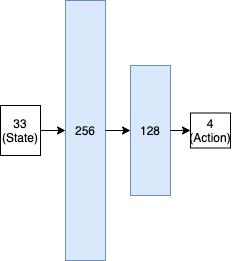
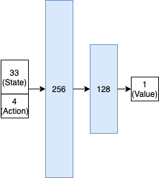
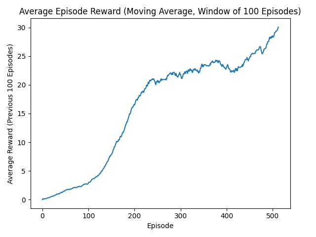

# Solving the Reacher Environment with DDPG 
[Deep Deterministic Policy Gradient (DDPG)](https://spinningup.openai.com/en/latest/algorithms/ddpg.html) [1] allows an 
agent to learn a policy that operates in continuous action spaces. In this project, we use it to solve the
["Reacher" Unity ML Environment](https://github.com/Unity-Technologies/ml-agents/blob/master/docs/Learning-Environment-Examples.md#reacher).

The goal in this environment is to train an agent that's capable of maneuvering a robotic arm such that its hand is
located within the target region (seen as a green sphere).

# Environment
## Observation Space
33 real-valued variables describing the position, rotation, velocity, and angular velocities of the arm. 

## Action Space
A float vector of size 4. The arm contains 2 joints, and each joint can be moved with 2 torque values. (Every entry is
bound between [-1, +1].)

## Reward Function
The agent receives a reward of +0.1 for every time step the hand is within the desired region.

## Solved
The environment is considered solved when the agent can receive an average reward of +30 or more, over a window of 100
episodes.

## Learning Algorithm
### Architecture
Both the Actor and Critic nets are feed-forward neural networks with 2 hidden layers – one with 256 neurons and one with
128 neurons. All hidden units use ReLU activations. Both make use of batch normalization after the input layer and all
hidden layers. The architecture diagrams below show the input, hidden and outputs layers, as well as the size of each 
of these layers.

#### Policy Network ("Actor")

#### Q-Net ("Critic")

### Hyperparameters
The following hyperparameter settings were used. (*Note*: a proper hyperparameter search could be performed in the
future). Both the actor and critic networks use the Adam optimizer.

|Hyperparameter|Setting|Description
|---|---|---|
|**Random Exploration Span**|10,000|This value controls for how long the agent does purely random exploration before using it's policy to collect experience.|
|**Max Episodes**|5,000|The maximum number of episodes to run for.|
|**Batch Size**|64|The size of the minibatches to use for SGD.|
|**Update Frequency**|5|After how many timesteps the model should be updated.|
|**Number of Inner Updates**|5|When updating the models (as defined by the Update Frequency), this setting defines how many consecutive rounds of SGD should be completed before continuing.|
|**Initial Noise STDEV**|1.0|While using the agent to gain experience, random noise is also added to the action space to help encourage exploration. This noise is sampled from a normal distribution. The standard deviation is initially set to 1.0 and decays per episode.|
|**Minimum Noise STDEV**|1e-3|The minimum the standard deviation of the noise distribution should be decayed to.|
|**Noise STDEV Decay Rate**|0.994|The rate to decay the standard deviation of the noise distribution, per episode.|
|**Max Replay Size**|200,000|The maximum number of experience tuples to store in the experience buffer.|
|**Gamma**|0.99|The future reward discount factor.|
|**Tau**|0.01|The (soft) mixing factor to use when updating target network weights.|
|**Policy Learning Rate**|0.001|The learning rate to use when training the policy (actor) network.|
|**Q-Net Learning Rate**|0.01|The learning rate to use when training the Q-Net (critic) network.|
|**Weight Decay**|0.0|The strength of L2 regularization to use when training both networks.|

## Plot of Rewards
Below is a plot of the average rewards earned by the agent during training (within a sliding window of 100 episodes).

As seen in the plot, the environment is solved after 512 episodes (as the goal of +30 is reached).

## Future Work
Some ideas for future work:
- Hyperparameter search: A search method such as grid/random search could be used to determine the most effective
  DDPG hyperparameter settings for this environment.
- Prioritized experience replay: Currently, all experience tuples are sampled uniformly. This distribution can be
  modified so that informative tuples are sampled more frequently (which often helps to make learning more stable). 
- Other algorithms, such as [TRPO](https://spinningup.openai.com/en/latest/algorithms/trpo.html) could also be
  implemented and compared to DDPG. 
- Multi agent environment: A version of the environment with 20 agents exists. Modifying DDPG or implementing another
  algorithm to handle these multiple agents at once could be done.

## References
1. [Lillicrap, Timothy P., Jonathan J. Hunt, Alexander Pritzel, Nicolas Manfred Otto Heess, Tom Erez, Yuval Tassa, David Silver and Daan Wierstra. “Continuous control with deep reinforcement learning.” CoRR abs/1509.02971 (2016): n. pag.](https://www.semanticscholar.org/paper/Continuous-control-with-deep-reinforcement-learning-Lillicrap-Hunt/024006d4c2a89f7acacc6e4438d156525b60a98f)
